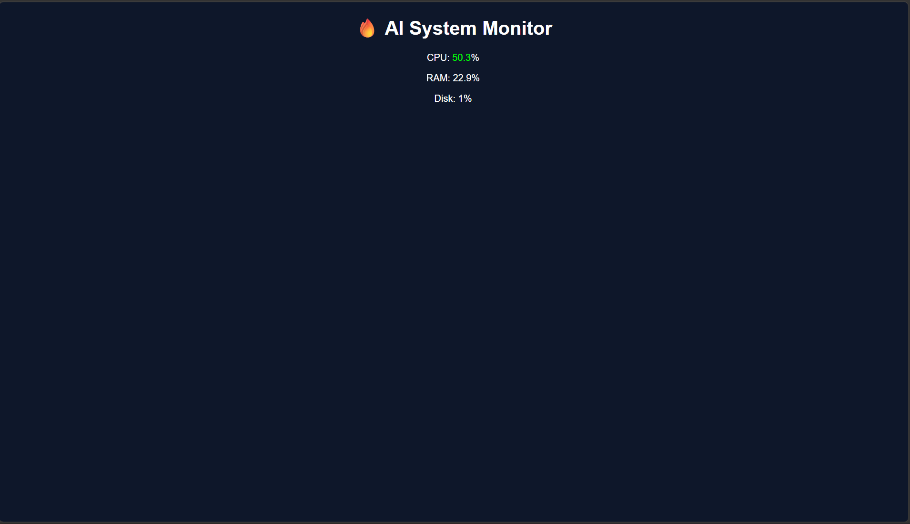

# 🤖 AI Self-Healing System

## 🚀 Overview

An intelligent system monitoring tool that detects anomalies in real-time and automatically resolves issues using machine learning.

---

## 🔥 Features

* 📊 Real-time CPU, RAM, Disk monitoring
* 🧠 ML-based anomaly detection (Isolation Forest)
* ⚠️ Automatic anomaly alerts
* 🔧 Auto-healing system (kills high CPU processes)
* 🌐 Live dashboard using Flask

---

## 🛠️ Tech Stack

* Python
* Flask
* scikit-learn
* psutil
* pandas

---

## 📸 Demo

### Dashboard

(Add screenshot here)

---

## ▶️ How to Run

```bash
git clone https://github.com/YOUR_USERNAME/ai-self-healing-system.git
cd ai-self-healing-system

pip install -r requirements.txt
python app.py
```

Open:
http://127.0.0.1:5000

## 📸 Demo



---

## 🧠 How It Works

1. Collects system metrics (CPU, RAM, Disk)
2. Trains ML model on normal behavior
3. Detects anomalies in real-time
4. Automatically kills high-resource processes

---

## 💼 Resume Highlight

Built an AI-powered self-healing system that monitors system performance, detects anomalies using machine learning, and automatically mitigates issues via process control.

---

## 🚀 Future Improvements

* Telegram alerts
* Live graphs (Chart.js)
* Cloud deployment
* Log analysis

---

## ⭐ If you like this project, give it a star!
